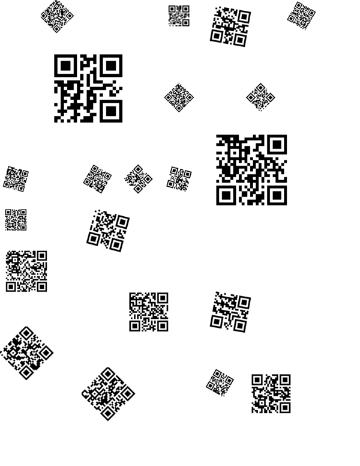

# QRapping Paper
Generate pages of scattered QR Codes out of your favorite links, text, etc.

## USAGE
Add your links, text, etc to 'things' List in [Qrapping.scala](src/main/scala/net/reisub/qrapping/Qrapper.scala#L7) 
sbt run
